# Manual de usuario - Denuncias Ecuador (CLI)

## Como ejecutar

1. Abra una terminal en la carpeta del proyecto.
2. Ejecute: `python principal.py`

## Menu de inicio

Opciones disponibles:

1. Iniciar sesion
2. Registrarse
3. Salir

### Captura 1

Menu de inicio con opciones de iniciar sesion, registrarse y salir.

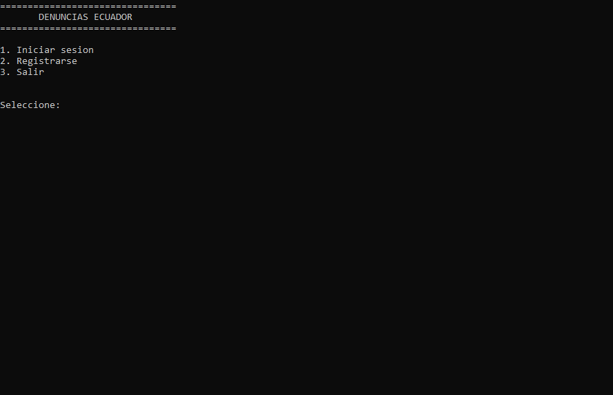

## Registro de usuario

Pasos:

1. Seleccione "Registrarse".
2. Ingrese un nombre de usuario (minimo 3 caracteres).
3. Ingrese una clave (minimo 6 caracteres).
4. Confirme la clave.
5. Si las claves no coinciden, vuelva a ingresarlas.
6. Confirme el registro con (s/n).
7. Al confirmar, ingresa automaticamente al sistema.

### Captura 2

Formulario de registro con usuario, clave y confirmacion.

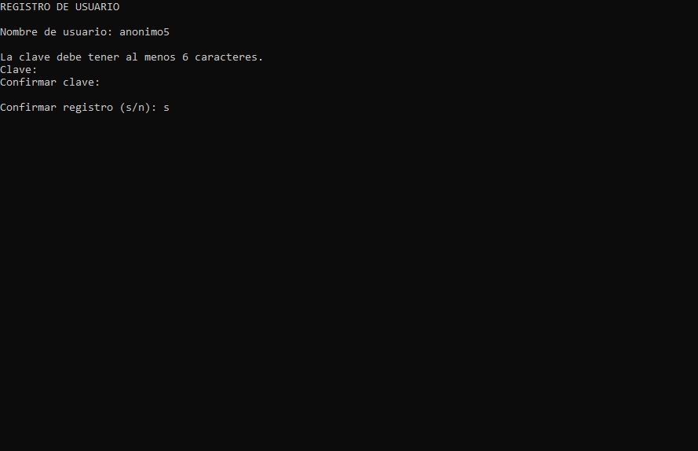

## Inicio de sesion

Pasos:

1. Seleccione "Iniciar sesion".
2. Ingrese usuario y clave.
3. La clave se oculta al escribir.
4. Si los datos son correctos, entra al menu correspondiente.

### Captura 3

Pantalla de inicio de sesion con usuario y clave oculto.

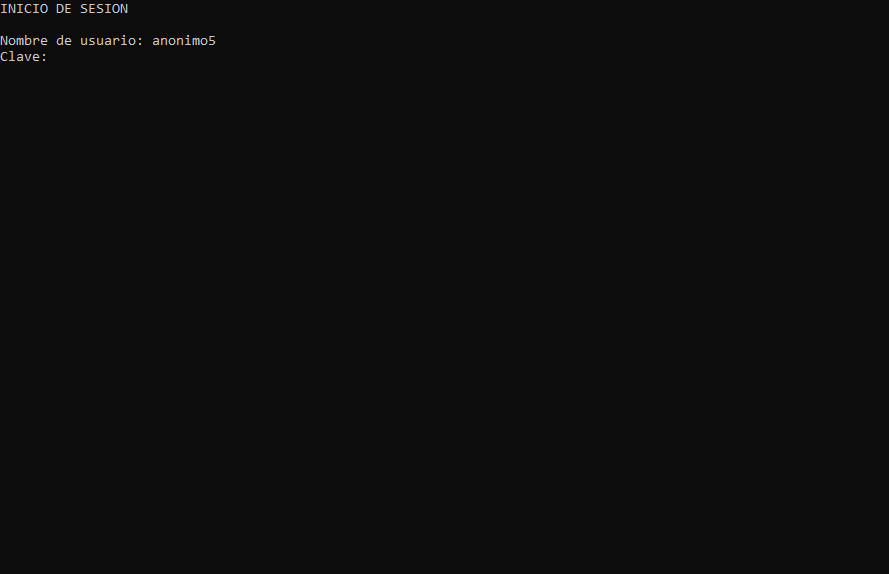

## Panel ciudadano

Opciones del menu:

1. Nueva denuncia
2. Mis denuncias
3. Buzon personal
4. Denuncias publicas
5. Cerrar sesion

### Captura 4

Panel ciudadano con opciones y contador de mensajes no leidos si aplica.

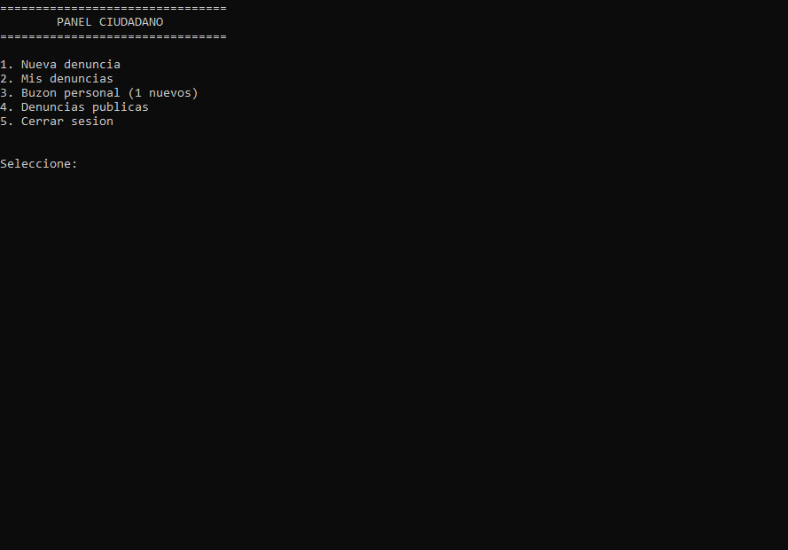

## Nueva denuncia

Pasos:

1. Seleccione "Nueva denuncia".
2. Ingrese el titulo.
3. Ingrese la descripcion.
4. Ingrese la fecha del evento (DD-MM-AAAA).
5. Seleccione la provincia por numero.
6. Seleccione la ciudad de la provincia por numero.
7. Seleccione el tipo de denuncia por numero.
8. Indique si es publica (s/n).
9. Revise el mensaje de confirmacion.

### Captura 5

Formulario de nueva denuncia con seleccion de provincia, ciudad, tipo y fecha.

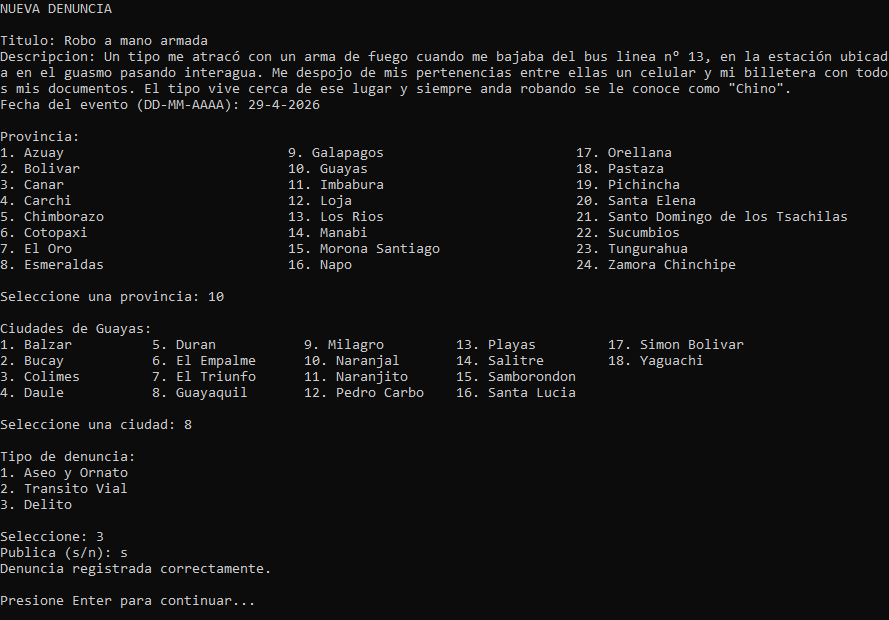

## Mis denuncias

Pasos:

1. Seleccione "Mis denuncias".
2. Revise el listado con titulo, tipo, fecha del evento y fecha de creacion.
3. Presione Enter para volver al menu.

### Captura 6

Listado de mis denuncias mostrando fecha de evento y fecha de creacion.

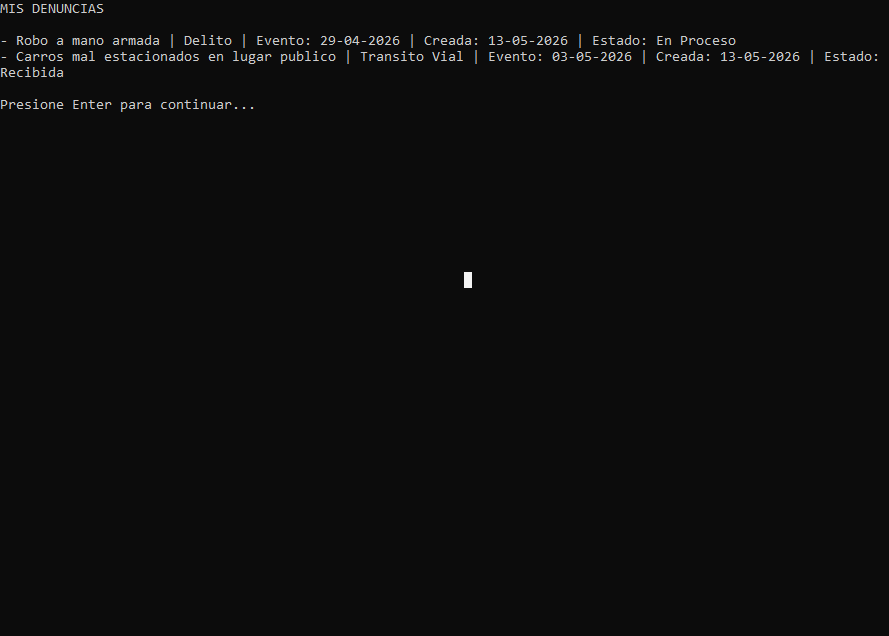

## Denuncias publicas

Pasos:

1. Seleccione "Denuncias publicas".
2. Elija el periodo (ultimo dia, ultima semana o todo).
3. Revise el listado mostrado.
4. Presione Enter para volver.

### Captura 7

Listado de denuncias publicas con filtro por periodo.

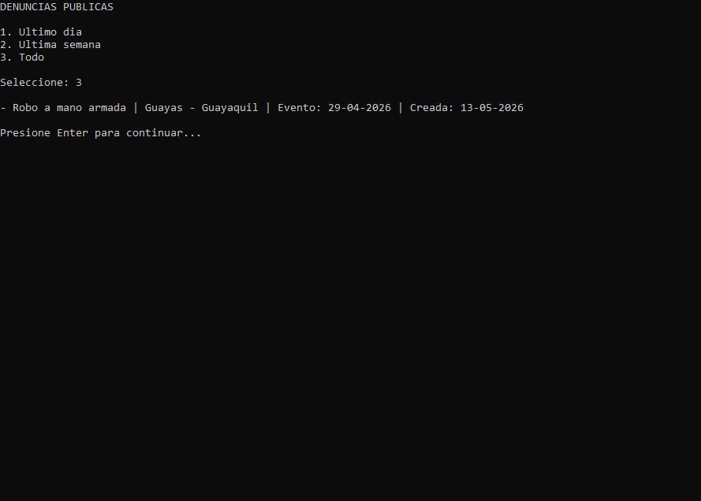

## Buzon personal

Pasos:

1. Seleccione "Buzon personal".
2. Elija una denuncia por numero.
3. Revise el historial de mensajes.
4. Escriba un mensaje y presione Enter, o presione Enter vacio para volver.

### Captura 8

Seleccion de denuncia y conversacion del buzon personal.

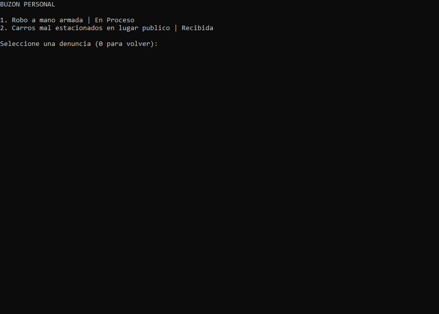
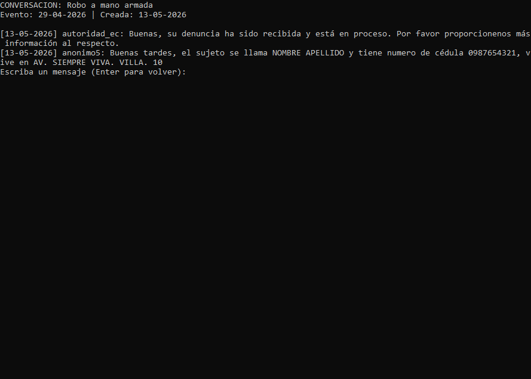

## Panel de autoridad

Usuario demo:

- Usuario: autoridad_ec
- Clave: Autoridad2026

Opciones del menu:

1. Ver denuncias
2. Buzon de mensajes
3. Cerrar sesion

### Captura 9

Panel de autoridad con opciones y contador de mensajes no leidos si aplica.

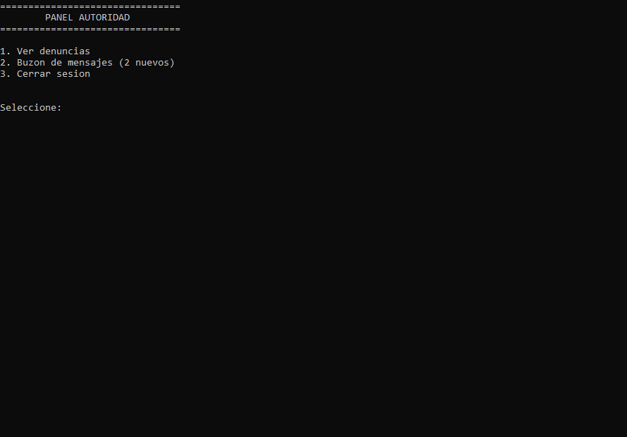

## Ver denuncias (autoridad)

Pasos:

1. Seleccione "Ver denuncias".
2. Aplique el filtro por tipo (0 para todos).
3. Aplique el filtro por estado (0 para todos).
4. Seleccione una denuncia por numero.
5. Revise el detalle completo.
6. Seleccione un nuevo estado o elija 0 para mantenerlo.

### Captura 10

Listado de denuncias con filtros por tipo y estado.

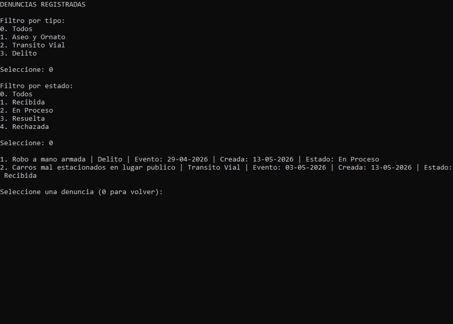

### Captura 11

Detalle de denuncia y seleccion de nuevo estado.

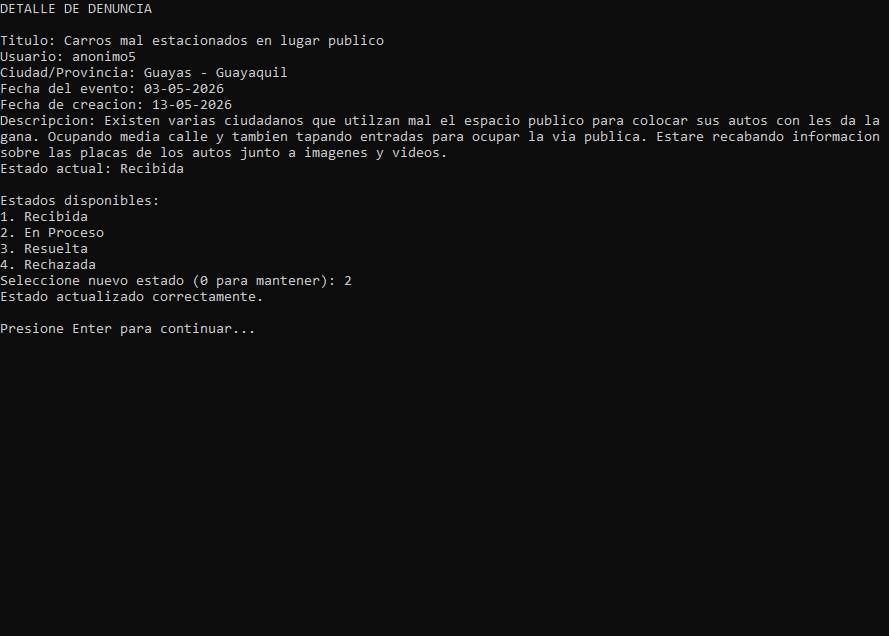

## Buzon de mensajes (autoridad)

Pasos:

1. Seleccione "Buzon de mensajes".
2. Elija una denuncia por numero.
3. Revise el historial de mensajes.
4. Escriba una respuesta y presione Enter.

### Captura 12

Conversacion de autoridad con historial de mensajes.

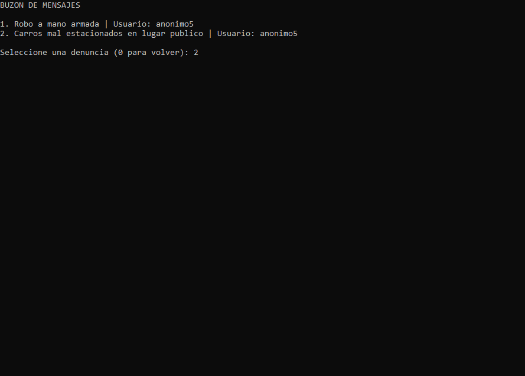
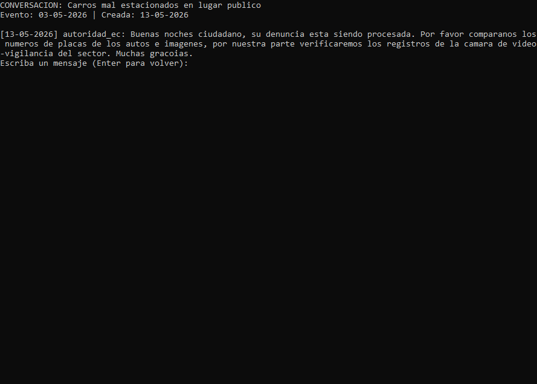

## Datos del sistema

Los datos se guardan en archivos JSON dentro de la carpeta datos:

- usuarios.json
- denuncias.json
- mensajes.json

## Notas y solucion de problemas

- Si una fecha no cumple DD-MM-AAAA, el sistema mostrara un mensaje de error.
- El conteo de mensajes no leidos aparece en los menus.
- Si no existe autoridad, se crea automaticamente una cuenta demo.
